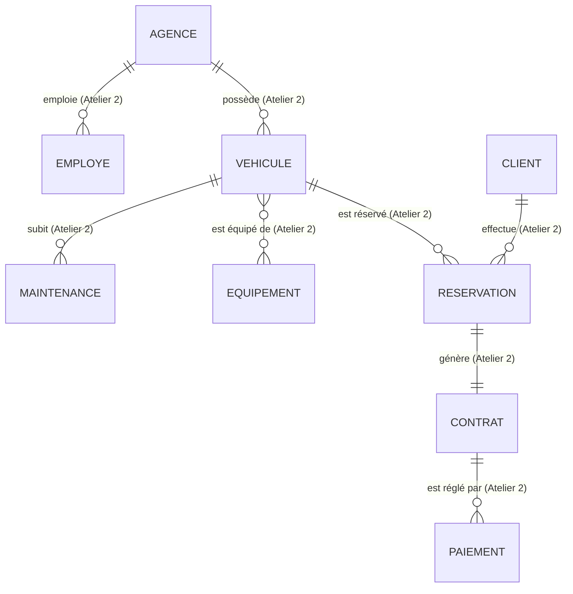

# 🚗 AutoLoc API — Atelier 1 (Séance 2)

> **Démarrage du projet Spring Boot + Maven et première entité JPA**
> 🎓 ESPRIT — UP ASI (Architecture des Systèmes d'Information) — ASI 26-27


---

## 📑 Sommaire

1. [🎯 Objectifs pédagogiques](#-objectifs-pédagogiques)
2. [🧰 Stack technique](#-stack-technique)
3. [📋 Prérequis](#-prérequis)
4. [📂 Structure du projet](#-structure-du-projet)
5. [⚙️ Configuration](#️-configuration)
6. [🗃️ Modèle de données](#️-modèle-de-données)
7. [🧱 Les entités JPA](#-les-entités-jpa)
8. [🔑 Stratégies de génération d'identifiants](#-stratégies-de-génération-didentifiants)
9. [🛠️ Stratégies ddl-auto](#️-stratégies-ddl-auto)
10. [✨ Lombok : utilisation ciblée](#-lombok--utilisation-ciblée)
11. [🌱 Bonus : profil dev et données de démo](#-bonus--profil-dev-et-données-de-démo)
12. [▶️ Lancer l'application](#️-lancer-lapplication)
13. [✅ Vérifier en base de données](#-vérifier-en-base-de-données)
14. [🐛 Problèmes rencontrés et solutions](#-problèmes-rencontrés-et-solutions)
15. [🔀 Workflow Git](#-workflow-git)
16. [📦 Livrables](#-livrables)
17. [🗺️ Suite du projet](#️-suite-du-projet)

---

## 🎯 Objectifs pédagogiques

- 🏗️ Créer un projet **Spring Boot / Maven** avec IntelliJ IDEA, prêt pour la persistance JPA.
- 📖 Comprendre l'arborescence générée et le rôle du fichier `pom.xml`.
- 🔌 Configurer la connexion à une base **MySQL** et les propriétés **Hibernate**.
- 🧩 Créer des entités JPA propres avec **Lombok** et les bonnes pratiques **Clean Code**.
- 🔍 Vérifier la **génération automatique du schéma** (DDL) au démarrage.

---

## 🧰 Stack technique

| Technologie | Version | Rôle |
|---|---|---|
| ☕ **Java** | 17 | Langage |
| 🍃 **Spring Boot** | 4.1.1 | Framework applicatif |
| 📦 **Maven** | wrapper (`mvnw`) | Gestion des dépendances et build |
| 🗄️ **Spring Data JPA** | 4.1.1 | Accès aux données |
| 🐘 **Hibernate ORM** | 7.4.5 | Implémentation JPA |
| 🐬 **MySQL / MariaDB** | 3306 | Base de données (`autoloc_db`) |
| 🌶️ **Lombok** | 1.18.x | Réduction du code répétitif |
| ✔️ **Validation** | starter | Validation des données (ateliers suivants) |
| 🔥 **DevTools** | starter | Rechargement automatique en développement |
| 🧠 **IntelliJ IDEA** | 2026.1 | IDE |

### Dépendances Maven

- `spring-boot-starter-web`
- `spring-boot-starter-data-jpa`
- `mysql-connector-j`
- `lombok`
- `spring-boot-starter-validation`
- `spring-boot-devtools`

---

## 📋 Prérequis

- ✅ **JDK 17+** installé et configuré dans IntelliJ IDEA
- ✅ **IntelliJ IDEA** (Community ou Ultimate)
- ✅ Un serveur **MySQL / MariaDB** démarré (ex. via XAMPP) sur le port `3306`
- ✅ Un client SQL (phpMyAdmin, MySQL Workbench, DBeaver…)
- ✅ **Postman** (ateliers suivants)
- ✅ **Git** et un compte GitHub
- ✅ Plugin **Lombok** installé et *Annotation Processing* activé dans IntelliJ

---

## 📂 Structure du projet

```
autoloc-api
├── 📁 src
│   ├── 📁 main
│   │   ├── 📁 java/tn/esprit/autoloc
│   │   │   ├── 📄 AutolocApiApplication.java
│   │   │   ├── 📁 config          → configuration (DataLoader)
│   │   │   ├── 📁 domain          → entités JPA et énumérations
│   │   │   ├── 📁 repository      → interfaces Spring Data JPA
│   │   │   ├── 📁 service         → couche métier (Atelier 4)
│   │   │   └── 📁 web
│   │   │       ├── 📁 controller  → contrôleurs REST (Atelier 5)
│   │   │       └── 📁 dto         → DTO (Atelier 6)
│   │   └── 📁 resources
│   │       ├── ⚙️ application.properties
│   │       └── ⚙️ application-dev.properties
│   └── 📁 test
└── 📄 pom.xml
```

---

## ⚙️ Configuration

### `application.properties` (configuration commune)

```properties
spring.application.name=autoloc-api
server.port=8081

# Connexion à la base de données
spring.datasource.url=jdbc:mysql://localhost:3306/autoloc_db?createDatabaseIfNotExist=true
spring.datasource.username=root
spring.datasource.password=

# Profil actif
spring.profiles.active=dev
```

### `application-dev.properties` (configuration de développement)

```properties
# Hibernate / JPA
spring.jpa.hibernate.ddl-auto=update
spring.jpa.show-sql=true
spring.jpa.properties.hibernate.format_sql=true

# Logs
logging.level.org.hibernate.SQL=DEBUG
logging.level.tn.esprit.autoloc=DEBUG
```

### 💡 Points à retenir

- 🆕 `createDatabaseIfNotExist=true` : le pilote crée la base `autoloc_db` si elle n'existe pas.
- 🔄 `ddl-auto=update` : Hibernate crée ou met à jour les tables à partir des entités.
- 🔐 **Sécurité** : ne jamais versionner un vrai mot de passe. Utiliser une variable d'environnement, par exemple `spring.datasource.password=${DB_PASSWORD:}`.
- 🚪 Le port **8081** est utilisé car le port 8080 était déjà occupé par Apache (`httpd.exe`).

---

## 🗃️ Modèle de données

Neuf entités, **sans association** à ce stade. Les relations seront ajoutées à l'**Atelier 2**.



> ⏳ Les liens ci-dessus sont la cible du modèle. Dans cet atelier, les tables ne contiennent **aucune clé étrangère**.

---

## 🧱 Les entités JPA

Toutes les entités sont dans le package `tn.esprit.autoloc.domain`.

| 🧩 Entité | 🔑 Identifiant | 📝 Attributs principaux |
|---|---|---|
| 🚘 **Vehicule** | `idVehicule` | immatriculation (unique), marque, modele, categorie, tarifJournalier, statut |
| 🏢 **Agence** | `idAgence` | nom, ville, adresse, telephone |
| 🙋 **Client** | `idClient` | nom, prenom, email (unique), telephone, numPermis (unique), dateInscription |
| 👔 **Employe** | `idEmploye` | nom, prenom, role |
| 🧰 **Equipement** | `idEquipement` | libelle |
| 📅 **Reservation** | `idReservation` | dateDebut, dateFin, statut |
| 📃 **Contrat** | `idContrat` | dateSignature, montantTotal, valide |
| 💳 **Paiement** | `idPaiement` | montant, datePaiement, modePaiement |
| 🔧 **Maintenance** | `idMaintenance` | dateDebut, dateFin, description |

### 🏷️ Les énumérations

| Enum | Valeurs |
|---|---|
| `StatutVehicule` | `DISPONIBLE`, `LOUE`, `MAINTENANCE` |
| `CategorieVehicule` | `CITADINE`, `BERLINE`, `SUV`, `UTILITAIRE` |
| `RoleEmploye` | `AGENT`, `MANAGER` |
| `StatutReservation` | `EN_ATTENTE`, `CONFIRMEE`, `ANNULEE`, `TERMINEE` |
| `ModePaiement` | `CARTE`, `ESPECES`, `VIREMENT` |

Les énumérations sont stockées avec `@Enumerated(EnumType.STRING)` : on enregistre le **nom** de la valeur (plus robuste que la position `ORDINAL`).

### 🧪 Exemple : l'entité `Vehicule`

```java
@Entity
@Table(name = "vehicule")
@Getter
@Setter
@NoArgsConstructor
@AllArgsConstructor
public class Vehicule {

    @Id
    @GeneratedValue(strategy = GenerationType.IDENTITY)
    private Long idVehicule;

    @Column(nullable = false, unique = true, length = 20)
    private String immatriculation;

    @Column(nullable = false, length = 50)
    private String marque;

    @Column(nullable = false, length = 50)
    private String modele;

    @Enumerated(EnumType.STRING)
    @Column(nullable = false, length = 20)
    private CategorieVehicule categorie;

    @Column(nullable = false, precision = 10, scale = 2)
    private BigDecimal tarifJournalier;

    @Enumerated(EnumType.STRING)
    @Column(nullable = false, length = 20)
    private StatutVehicule statut;
}
```

### 📌 Annotations utilisées

| Annotation | Rôle |
|---|---|
| `@Entity` | Déclare une classe persistée en base |
| `@Table` | Nom de la table |
| `@Id` | Clé primaire |
| `@GeneratedValue` | Génération automatique de l'identifiant |
| `@Column` | Contraintes de colonne (`nullable`, `unique`, `length`, `precision`, `scale`) |
| `@Enumerated` | Mode de stockage d'une énumération |

---

## 🔑 Stratégies de génération d'identifiants

Choix retenu pour AutoLoc : **`IDENTITY`** (auto-incrément MySQL).

| Stratégie | Principe | Avantages / limites |
|---|---|---|
| 🆔 **IDENTITY** | Colonne `AUTO_INCREMENT` gérée par le SGBD | Simple, natif MySQL. Désactive le batching des INSERT |
| 🔢 **SEQUENCE** | Séquence gérée par le SGBD | Performante, compatible batching. Indisponible sur MySQL avant 8.0 |
| 🗂️ **TABLE** | Table dédiée simulant une séquence | Portable mais coûteuse |
| 🤖 **AUTO** | Hibernate choisit selon le dialecte | Pratique mais moins prévisible |

---

## 🛠️ Stratégies ddl-auto

| Valeur | Comportement | Usage |
|---|---|---|
| ⛔ `none` | Ne touche pas au schéma | Production avec outil de migration |
| 🛡️ `validate` | Compare entités et schéma, erreur si différence | Préproduction / production |
| 🔄 `update` | Ajoute tables et colonnes manquantes, sans rien supprimer | **Développement (choix AutoLoc)** |
| 💥 `create` | Supprime puis recrée les tables à chaque démarrage | Tests ponctuels, données perdues |
| 🧹 `create-drop` | Comme `create`, plus suppression à l'arrêt | Tests automatisés |

> ⚠️ `update` est adapté au développement uniquement. Une colonne renommée dans le code est **dupliquée**, pas migrée.

---

## ✨ Lombok : utilisation ciblée

Les entités utilisent uniquement :

- `@Getter` et `@Setter`
- `@NoArgsConstructor` (obligatoire pour JPA)
- `@AllArgsConstructor`

❌ **`@Data` est volontairement évité** sur les entités : il génère `toString`, `equals` et `hashCode` sur tous les champs, y compris les associations. Avec des relations bidirectionnelles (Atelier 2), cela provoque une boucle infinie (`StackOverflowError`).

---

## 🌱 Bonus : profil dev et données de démo

### 🎛️ Profil `dev`

Un **profil Spring** regroupe la configuration propre à un environnement.

| Fichier | Contenu |
|---|---|
| `application.properties` | Configuration commune + `spring.profiles.active=dev` |
| `application-dev.properties` | Réglages de développement (`ddl-auto`, logs SQL) |

Au démarrage, la console confirme :

```
The following 1 profile is active: "dev"
```

**Bénéfices :** séparation des environnements, sécurité (pas de réglages de dev en production), même code pour plusieurs configurations.

### 📥 `CommandLineRunner` : véhicules de démonstration

Classe `DataLoader` (package `config`) : insère **3 véhicules** au démarrage.

```java
@Configuration
@Profile("dev")
public class DataLoader {

    @Bean
    CommandLineRunner initVehicules(VehiculeRepository repository) {
        return args -> {
            if (repository.count() > 0) {
                return;
            }
            repository.saveAll(List.of(
                    new Vehicule(null, "123 TUN 4567", "Renault", "Clio",
                            CategorieVehicule.CITADINE, new BigDecimal("80.00"), StatutVehicule.DISPONIBLE),
                    new Vehicule(null, "234 TUN 5678", "Peugeot", "508",
                            CategorieVehicule.BERLINE, new BigDecimal("150.00"), StatutVehicule.DISPONIBLE),
                    new Vehicule(null, "345 TUN 6789", "Toyota", "RAV4",
                            CategorieVehicule.SUV, new BigDecimal("220.00"), StatutVehicule.LOUE)
            ));
        };
    }
}
```

| Élément | Explication |
|---|---|
| `CommandLineRunner` | S'exécute une fois, après le démarrage complet de l'application |
| `@Profile("dev")` | Le composant n'existe qu'avec le profil `dev` : pas de fausses données en production |
| `count() > 0` | Rend l'insertion **idempotente** : pas de doublons ni d'erreur d'unicité au redémarrage |
| `null` en 1er argument | L'identifiant est généré par la base (`IDENTITY`) |

---

## ▶️ Lancer l'application

### Depuis IntelliJ

1. Ouvrir `AutolocApiApplication.java`
2. Cliquer sur ▶ **Run**
3. Vérifier dans la console :
   - `The following 1 profile is active: "dev"`
   - les requêtes DDL `create table ...`
   - `Started AutolocApiApplication in ... seconds`

### Depuis la ligne de commande

```bash
# Windows
mvnw.cmd spring-boot:run

# Linux / macOS
./mvnw spring-boot:run
```

L'application écoute sur **http://localhost:8081**.

---

## ✅ Vérifier en base de données

```sql
USE autoloc_db;
SHOW TABLES;
DESCRIBE vehicule;
SELECT * FROM vehicule;
```

Résultat attendu : **9 tables**

`agence` · `client` · `contrat` · `employe` · `equipement` · `maintenance` · `paiement` · `reservation` · `vehicule`

Et **3 lignes** dans `vehicule` grâce au `CommandLineRunner`.

---

## 🐛 Problèmes rencontrés et solutions

| 🚨 Problème | 🔎 Cause | ✅ Solution |
|---|---|---|
| `Port 8080 was already in use` | Apache (`httpd.exe`) occupe le port | Ajouter `server.port=8081` |
| `Cannot Create Class : already exists` | Fichier créé avec le mauvais type | Supprimer puis recréer en choisissant **Enum** |
| Getters/setters en rouge | Annotation processing désactivé | Activer *Enable annotation processing* |
| `Repository not found` au push | Dépôt GitHub inexistant ou non authentifié | Créer le dépôt, puis `git remote set-url origin ...` |
| `Database version: 5.5.5` | Numéro de compatibilité de **MariaDB** (XAMPP) | Sans conséquence pour cet atelier |

---

## 🔀 Workflow Git

```bash
git add .
git commit -m "Atelier 1 : init projet Spring Boot + entité Vehicule"
git push -u origin main
```

| 📝 Commit | Contenu |
|---|---|
| `Atelier 1 : init projet Spring Boot + entité Vehicule` | Projet, configuration, entité `Vehicule` |
| `Prépa Atelier 2 : entités restantes sans associations` | 8 entités et 3 énumérations |
| `Bonus : profil dev et CommandLineRunner de demo` | Profil `dev` et données de démonstration |

---

## 📦 Livrables

- [x] Projet Spring Boot exécutable, connecté à MySQL
- [x] Entité `Vehicule` propre (Lombok ciblé, sans getters/setters manuels)
- [x] `application.properties` configuré et versionné
- [x] Logs applicatifs lisibles (INFO au démarrage, DEBUG pour le SQL)
- [x] 9 entités JPA générant leurs tables
- [x] Premier commit poussé sur GitHub
- [x] Bonus : `CommandLineRunner` + profil `dev`

---

## 🗺️ Suite du projet

| Atelier | Contenu |
|---|---|
| 🔗 **Atelier 2** | Associations (`@OneToMany`, `@ManyToOne`, `@ManyToMany`, `@OneToOne`), cascade et fetch |
| 🗂️ **Atelier 3** | Repositories Spring Data JPA |
| 🧠 **Atelier 4** | Couche service (logique métier) |
| 🌐 **Atelier 5** | Contrôleurs REST |
| 📨 **Atelier 6** | DTO et validation |

---

## 👤 Auteur

**Nazim Chaouch** — [@Nazimchaouch04](https://github.com/Nazimchaouch04)
🎓 ESPRIT — Honoris United Universities — *Se former autrement*
